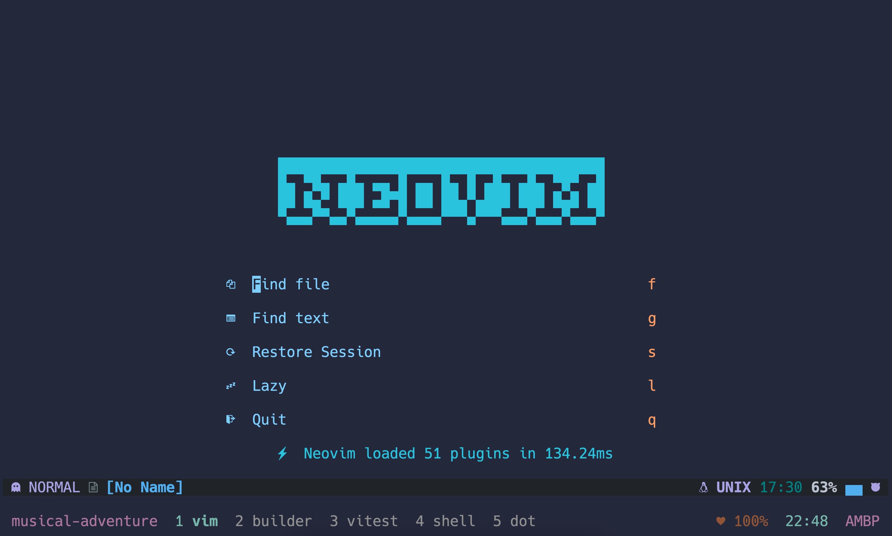
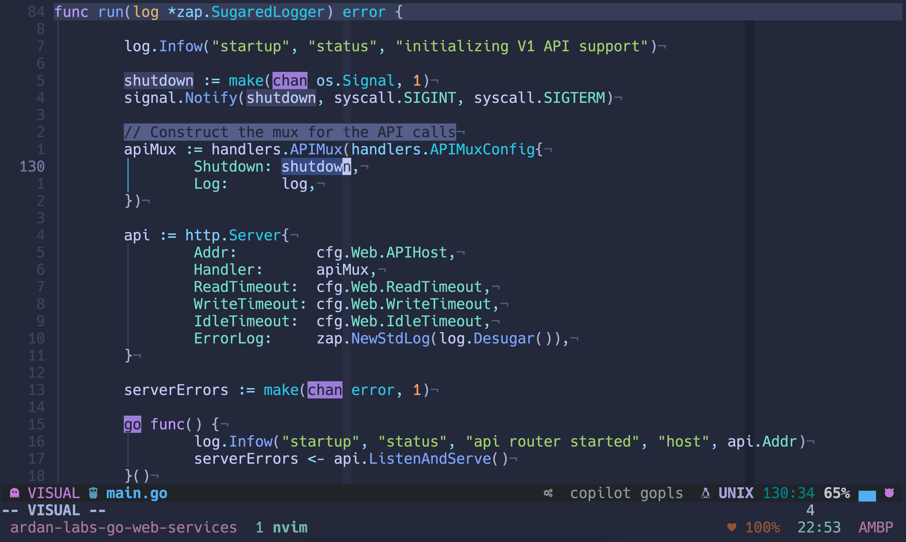
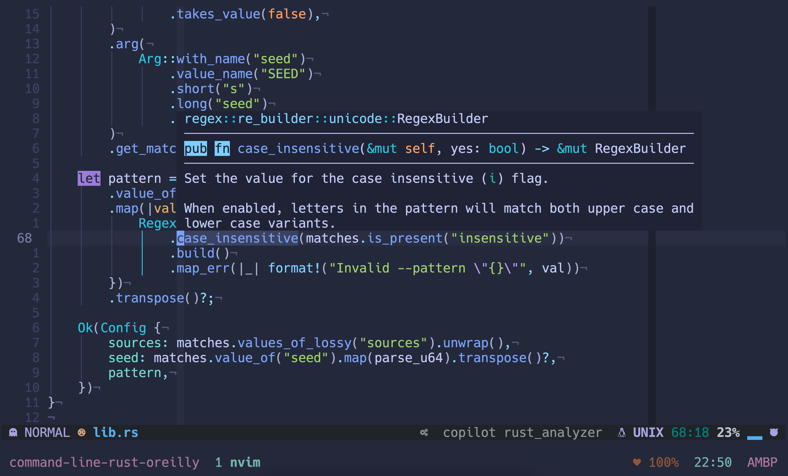

# Dotfiles

[Since the beginning I felt your strength](https://www.youtube.com/watch?v=lqDhEaTcgYc#t=1m3s)

---

Used for macOS but making changes to make it more platform agnostic.

---

Forked and tweaked from [nicknisi/dotfiles](https://github.com/nicknisi/dotfiles)

Inspired/stolen bits from:

[kevinhwang91/dotfiles](https://github.com/kevinhwang91/dotfiles)

[ThePrimeagen/.dotfiles](https://github.com/ThePrimeagen/.dotfiles)

[olimorris/dotfiles](https://github.com/olimorris/dotfiles)

## Appearance

How my setup looks for my daily driving:







Currently finished the lovely book [Command Line Rust](https://www.amazon.com/Command-Line-Rust-Project-Based-Primer-Writing/dp/1098109430). Highly recommended.

### Todos

Putting the todo near the top to let people know the instructions below may be
incorrect, if you would like help I'd recommend using the
[discussions](https://github.com/azemetre/dotfiles/discussions) to ask a
question.

- [ ] neovim updates:
  - [x] Move from `vim-plug` to `packer.nvim`
  - [x] Move from `packer.nvim` to `lazy.nvim`
  - [ ] List current installed plugins with their purpose
  - [ ] Setup DAP for various languages
  - [ ] Fix `null-ls` issues for:
    - [x] prettier
    - [ ] lua
    - [x] gopls
  - [ ] Fit Trogdor the Burninator into `alpha-nvim`
- [ ] `Brewfile` cleanup and add comments
- [ ] Move core configurations into `config`:
  - [ ] git
  - [ ] tmux
  - [ ] zshrc
- [x] Verify if `applescripts` is needed
- [ ] zsh config
  - [ ] Verify zsh works in multiple terminals (iterm, alacritty, terminal, etc)
  - [ ] Clean zsh scripts
- [ ] Fix `bin` setup (some script's aren't working)
- [ ] Create helper script to give appropriate files appropriate privileges
- [ ] Documentation rewrite:
  - [ ] What roads I drive on with this setup
  - [ ] Rewrite Installation instructions
  - [x] Rewrite Font section
  - [ ] Update table of contents
  - [ ] Detail what each `brew` formula is used for
  - [ ] Add a `why vim?` section
  - [ ] Add a `how I use tmux` section

## Contents

- [Initial Setup and Installation](#initial-setup-and-installation)
- [ZSH Setup](#zsh-setup)
- [Prompt](#prompt)
- [Vim and Neovim Setup](#vim-and-neovim-setup)
- [Fonts](#fonts)
- [Tmux](#tmux-configuration)

## Initial Setup and Installation

### Backup

First, you may want to backup any existing files that exist so this doesn't overwrite your work.

Run `install/backup.sh` to backup all symlinked files to a `~/dotfiles-backup` directory.

This will not delete any of these files, and the install scripts will not overwrite any existing. After the backup is complete, you can delete the files from your home directory to continue installation.

### Installation

If on OSX, you will need to install the XCode CLI tools before continuing. To do so, open a terminal and type

```bash
➜ xcode-select --install
```

Then, clone the dotfiles repository to your home directory as `~/.dotfiles`.

```bash
➜ git clone https://github.com/azemetre/dotfiles.git ~/.dotfiles
➜ cd ~/.dotfiles
➜ ./install.sh
```

`install.sh` will start by initializing the submodules used by this repository (if any). **Read through this file and comment out anything you don't want installed.** Then, it will install all symbolic links into your home directory. Every file with a `.symlink` extension will be symlinked to the home directory with a `.` in front of it. As an example, `vimrc.symlink` will be symlinked in the home directory as `~/.vimrc`. Then, this script will create a `~/.vim-tmp` directory in your home directory, as this is where vim is configured to place its temporary files. Additionally, all files in the `$DOTFILES/config` directory will be symlinked to the `~/.config/` directory for applications that follow the [XDG base directory specification](http://standards.freedesktop.org/basedir-spec/basedir-spec-latest.html), such as neovim.

Next, the install script will perform a check to see if it is running on an OSX machine. If so, it will install Homebrew if it is not currently installed and will install the homebrew packages listed in [`Brewfile`](Brewfile). Then, it will run [`osx.sh`](install/osx.sh) and change some OSX configurations. This file is pretty well documented and so it is advised that you **read through and comment out any changes you do not want**.

## Terminal Capabilities

In order to properly support italic fonts in and out of tmux, a couple of terminal capabilities need to be described. Run the following from the root of the project:

```bash
tic -x resources/xterm-256color-italic.terminfo
tic -x resources/tmux.terminfo
```

## ZSH Setup

ZSH is configured in the `zshrc.symlink` file, which will be symlinked to the home directory. The following occurs in this file:

- set the `EDITOR` to nvim
- Load any `~/.terminfo` setup
- Set the `CODE_DIR` variable, pointing to the location where the code projects exist for exclusive autocompletion with the `c` command
- Recursively search the `$DOTFILES/zsh` directory for files ending in .zsh and source them
- Setup zplug plugin manager for zsh plugins and installed them.
- source a `~/.localrc` if it exists so that additional configurations can be made that won't be kept track of in this dotfiles repo. This is good for things like API keys, etc.
- Add the `~/bin` and `$DOTFILES/bin` directories to the path
- And more...

### Prompt

The prompt is meant to be simple while still providing a lot of information to the user, particularly about the status of the git project, if the PWD is a git project. This prompt sets `precmd`, `PROMPT` and `RPROMPT`. The `precmd` shows the current working directory in it and the `RPROMPT` shows the git and suspended jobs info. The main symbol used on the actual prompt line is `❯`.

The prompt attempts to speed up certain information lookups by allowing for the prompt itself to be asynchronously rewritten as data comes in. This prevents the prompt from feeling sluggish when, for example, the user is in a large git repo and the git prompt commands take a considerable amount of time.

It does this by writing the actual text that will be displayed int he prompt to a temp file, which is then used to update the prompt information when a signal is trapped.

#### Git Prompt

The git info shown on the `RPROMPT` displays the current branch name, along with the following symbols.

- `+` - New files were added
- `!` - Existing files were modified
- `?` - Untracked files exist that are not ignored
- `»` - Current changes include file renaming
- `✘` - An existing tracked file has been deleted
- `$` - There are currently stashed files
- `=` - There are unmerged files
- `⇡` - Branch is ahead of the remote (indicating a push is needed)
- `⇣` - Branch is behind the remote (indicating a pull is needed)
- `⇕` - The branches have diverged (indicating history has changed and maybe a force-push is needed)
- `✔` - The current working directory is clean

#### Jobs Prompt

The prompt will also display a `✱` character in the `RPROMPT` indicating that there is a suspended job that exists in the background. This is helpful in keeping track of putting vim in the background by pressing CTRL-Z.

#### Node Prompt

If a `package.json` file or a `node_modules` directory exists in the current working directory, display the node symbol, along with the current version of Node. This is useful information when switching between projects that depend on different versions of Node.

## Vim and Neovim Setup

[Neovim](https://neovim.io/) is a fork and drop-in replacement for vim. in most cases, you would not notice a difference between the two, other than Neovim allows plugins to run asynchronously so that they do not freeze the editor, which is the main reason I have switched over to it. Vim and Neovim both use Vimscript and most plugins will work in both (all of the plugins I use do work in both Vim and Neovim). For this reason, they share the same configuration files in this setup. Neovim uses the [XDG base directory specification](http://standards.freedesktop.org/basedir-spec/basedir-spec-latest.html) which means it won't look for a `.vimrc` in your home directory. Instead, its configuration looks like the following:

|                         | Vim        | Neovim                    |
| ----------------------- | ---------- | ------------------------- |
| Main Configuration File | `~/.vimrc` | `~/.config/nvim/init.vim` |
| Configuration directory | `~/.vim`   | `~/.config/nvim`          |

### Installation

Vim is likely already installed on your system. If using a Mac, MacVim will be installed from Homebrew. Neovim will also be installed from Homebrew by default on a Mac. For other systems, you may need to install Neovim manually. See their [web site](https://neovim.io) for more information.

[`link.sh`](install/link.sh) will symlink the XDG configuration directory into your home directory and will then create symlinks for `.vimrc` and `.vim` over to the Neovim configuration so that Vim and Neovim will both be configured in the same way from the same files. The benefit of this configuration is that you only have to maintain a single vim configuration for both, so that if Neovim (which is still alpha software) has issues, you can very seamlessly transition back to vim with no big impact to your productivity.

Inside of [`.zshrc`](zsh/zshrc.symlink), the `EDITOR` shell variable is set to `nvim`, defaulting to Neovim for editor tasks, such as git commit messages. Additionally, I have aliased `vim` to `nvim` in [`aliases.zsh`](zsh/aliases.zsh) You can remove this if you would rather not alias the `vim` command to `nvim`.

## Fonts

I am currently using [Hack](https://sourcefoundry.org/hack/) as my default font,
it is MIT licensed. More explicitly the
[Hack nerd font](https://github.com/ryanoasis/nerd-fonts/tree/master/patched-fonts/Hack),
this allows for non-ascii characters to be used in my terminal.

## Tmux Configuration

Tmux is a terminal multiplexor which lets you create windows and splits in the terminal that you can attach and detach from. I use it to keep multiple projects open in separate windows and to create an IDE-like environment to work in where I can have my code open in vim/neovim and a shell open to run tests/scripts. Tmux is configured in [~/.tmux.conf](tmux/tmux.conf.symlink), and in [tmux/theme.sh](tmux/theme.sh), which defines the colors used, the layout of the tmux bar, and what what will be displayed, including the time and date, open windows, tmux session name, computer name, and current iTunes song playing. If not running on macOS, this configuration should be removed.

## Alacritty

Sometimes we work for employers that are quite restrictive, so restrictive that
you can't run 3rd party software. To side step this issue, you can allow
Alacritty to run on OSX with the following command:

```shell
sudo xattr -d com.apple.quarantine /path/to/Alacritty.app
```

Where `path/to/Alacritty.app` is the current location of Alacritty, for me this
is `/Applications/Alacritty.app`.

After quarantining Alacritty you should be permitted to use the tools you want
in order to do your job as best fit.

## Questions

If you have questions, notice issues, or would like to see improvements, please open an [issue](https://github.com/azemetre/dotfiles/issues/new) and I'm happy to help you out!
